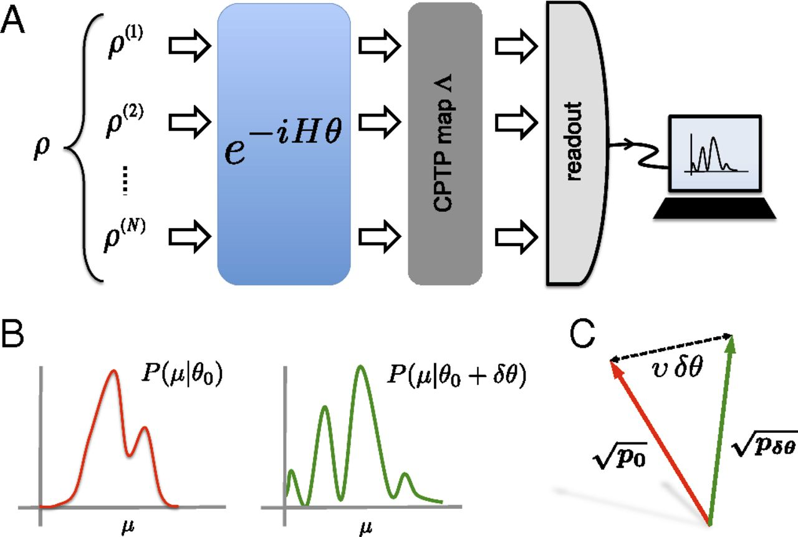
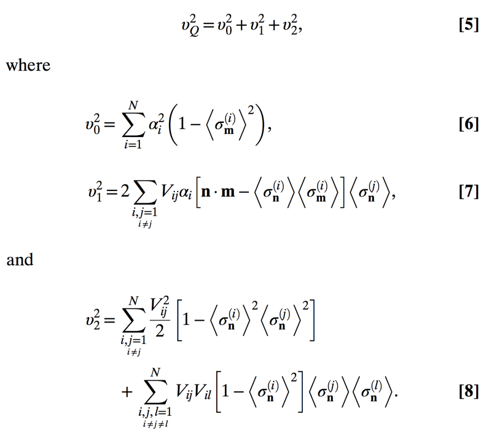
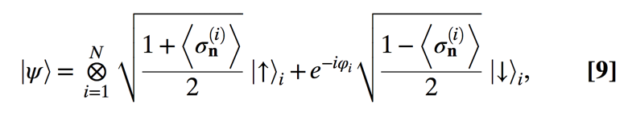
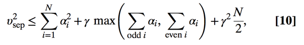
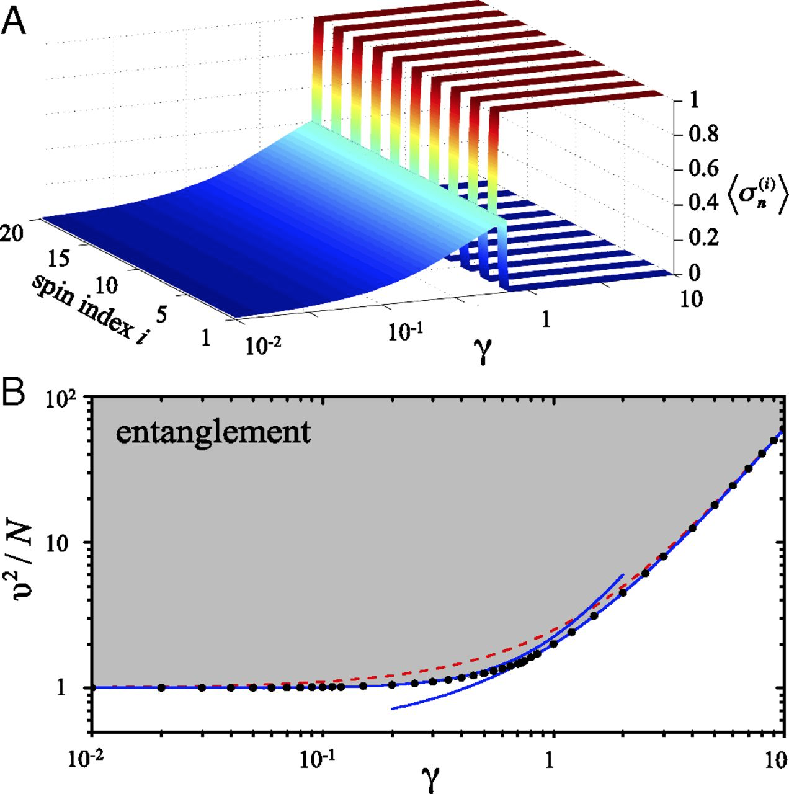
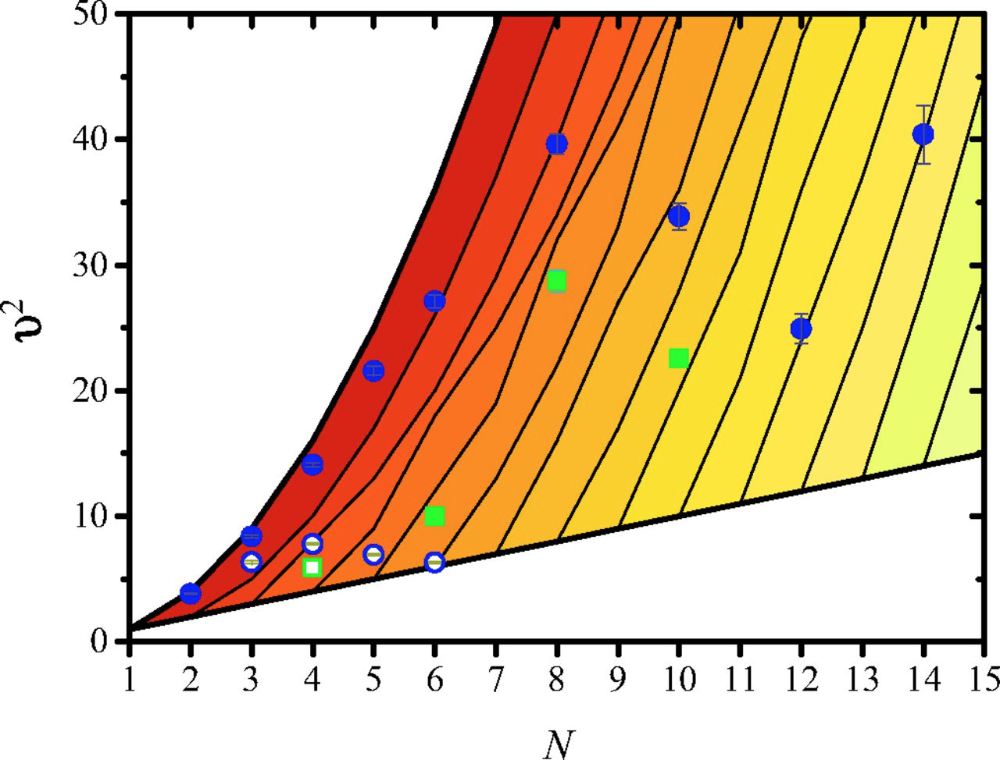

### 前言

在量子技术中的一个核心问题是探测和刻画关联体系中的纠缠. 一个非常流行的做法是基于纠缠目击算符的实现. 纠缠目击者是一个厄米算符 $W$, 对于所有的可分态 $\rho_{sep}$ 满足 $Tr[\rho_{sep} W] \geq 0$, 并且存在至少一个纠缠态 $\rho$ 使得 $Tr[\rho W] < 0$. 这种方法的重要性体现在这样一个代数学事实上, 对于每一个多体纠缠态至少存在一个纠缠目击算符. 纠缠目击者是设备依赖的: 实验上对于设备的不完整刻画可能导致假阳性, 也就是说, 某些实验上不正确的实现 $W_{sep} \neq W$ 使得 $Tr[\rho_{sep} W_{sep}] < 0$ 对于某些可分态也成立, 因此将某些只有经典关联的态也误判为纠缠态. 同样的问题, 甚至更戏剧性地, 也出现在通过量子层析重建量子态来探测纠缠.

在文献 (21-23) 中提出了一种不需要构造目击算符来探测纠缠的方法. 这种方法利用了 Fisher 信息(或 "统计速度")来量化在局域参数化过程中两个略微不同的量子态变得统计可区分的速度. 在本文中作者证明了相当一大类纠缠态可以通过统计可区分性探测到. 本文中所使用的方法并不是设备无关的, 因为需要非局域变换的实验控制. 然而在参数变换之后任意噪声, 退相干或者有限的读出效率都不会带来假阳性的结果. 通过统计区分性探测纠缠的特有的优点是它的简单性. 在本文中作者通过公开的实验数据验证了 14 个离子或者 10 个光子的纠缠, 与文献 20 中报道的用基于贝尔不等式的 DIEW 的结果相一致, 以及到至多 6 个离子的真正的多体纠缠.

### 模型

- (A) N 体态 $\rho$ 经过一个有着可调参数 $\theta$ 的非局域酉变换, 一个包含任意 $\theta$ 无关的退相干作用的完全正定保迹映射 $\Lambda$.
- (B) 通过收集不同的参数 $\theta$ 下的测量结果 $\mu$  来得到对应概率分布 $P(\mu|\theta)$, 这里取为 $\theta_0$(红线) 和 $\theta_0+\delta\theta$ (绿线). 
- (C) 为了量化两个概率分布之间的统计区分性, 作者引入了单位向量 $\sqrt{\mathbf{p}_0}=\{P(\mu|\theta_0)^{1/2}\}_{\mu}$ (红线)和 $\sqrt{\mathbf{p}_{\delta\theta}}=\{P(\mu|\theta_0+\delta\theta)^{1/2}\}_{\mu}$ (绿线), 并且计算它们之间的欧几里得距离 $r=2||\sqrt{\mathbf{p}_0}-\sqrt{\mathbf{p}_{\delta\theta}}||$ (虚线), 见于 Eq. 2. 统计速度是一个纠缠目击者, 见于 Eq. 3.

### 结果

考虑 $N$ 体态 $\rho$ 经过一个酉变换 $e^{-iH\theta}$,
$$
H=\sum_{i=1}^N\frac{\alpha_i}{2}\sigma_{\mathbf{m}}^{(i)}+\sum_{i,j=1}^N\frac{V_{ij}}{4}\sigma_{\mathbf{n}}^{(i)}\sigma_{\mathbf{n}}^{(j)},
$$

系数 $\alpha_i$ 代表局域操作, $V_{ij}=V_{ji}$ 提供了非局域相互作用.

然后介绍了 Hellinger distance:

$$
\mathscr{l}(\theta_0,\theta)\equiv 2\sqrt{\sum_\mu(\sqrt{P(\mu|\theta_0)}-\sqrt{P(\mu|\theta)})^2}.
$$

Hellinger distance 用于量化两个概率分布之间的相似性(注意: 本文中的定义与维基百科上的定义相差了一个系数 $2\sqrt{2}$). $\mathscr{l}$ 是一种统计距离, 取值范围是从 $0$ 到 $2\sqrt{2}$; 满足三角不等式.

之后引入了 "统计速度" (statistical speed) 的定义:
$$\mathscr{v}\equiv \frac{d\mathscr{l}}{d\theta}\Big|_{\theta_0}.$$

$\mathscr{v}$ 刻画了 $\mathscr{l}(\theta_0,\theta)$ 在参考点 $\theta_0$ 附近随 $\theta$ 变化的速率. 提取出统计速度需要(至少)两个 settings, 而与粒子个数, 量子态及测量算符无关. 

如果统计速度大于如下的界, 则意味着纠缠:
$$\mathscr{v}_{sep}\equiv \underset{\ket{\psi_{sep}},\Lambda,M}{\text{max}}\mathscr{v}.$$

最大化遍历所有的可分纯态 $\psi_{sep}$, 正映射 $\Lambda$, 及所有的测量 $M$. 由于 Fisher 信息的凸性(convexity), 上面的界不仅对直积纯态, 而且对任意混态也成立. 上式所列出的界是可分态所能达到的最大的量子统计速度 $\mathscr{v}_{sep}=\text{max}_{\ket{\psi_{sep}}}\mathscr{v}_Q.$

对于一个给定的态 $\rho$, 量子统计速度被定义为 $\mathscr{v}_Q\equiv\text{max}_{M}\mathscr{v}$, 其平方可以通过 $\mathscr{v}_Q^2=\text{Tr}[\rho L^2]$ 计算, 其中 $L$ 是对称对数导数(symmetric logarithmic derivative), 定义为 $\frac{d\rho}{d\theta}=\frac{L\rho+\rho L}{2}$ (32,33).

量子统计速度在酉变换后的 $\theta$ 无关的映射 $\Lambda$ 的作用下保持不变或减少. 作者强调 $\Lambda$ 可以是非局域的, 也就是说, 可以产生纠缠. 因为上述的界 $\mathscr{v}_{sep}$ 是通过遍历所有读出最大化的, 在参数变换后对于任意的噪声和退相干影响, 不会产生假阳性.

下面作者给出了一些计算 $\mathscr{v}$ 的例子.

对于局域的哈密顿量($V_{ij}=0$), 界为 $\mathscr{v}^2=N$. 对于非局域的哈密顿量 ($V_{ij}\neq 0$), 界依赖于 $V_{ij}$ 和 $\alpha_i$ 的形式. 通常可以数值计算, 在许多情况下也可以解析计算. 之后作者考虑了有着近邻相互作用 $V_{ij}=\gamma\frac{\delta_{j,i+i}+\delta_{j,i-q}}{2}$ 和 $\mathbf{n}\cdot\mathbf{m}=1$ 的 Ising 模型. 在附录中作者也报告了对于相互作用为 $V_{ij}=\gamma$ 的 Lipkin–Meshkov–Glick 模型的结果.

使 Eq. 5 式达到最大的态是

其中, $\ket{\uparrow}$ 和 $\ket{\downarrow}$ 是 $\sigma_{\mathbf{n}}$ 的本征态, $\phi_i$ 是任意参数.

$\mathscr{v}_{sep}^2$ 的上界由下式给出,

- (A) 对于可分态使 $\mathscr{v}^2_Q$ 最大化的平均自旋值 $\langle\sigma_{\mathbf{n}}^{(i)}\rangle$, 随 $\gamma$ 变化的曲线图.
- (B) 点线是由 Ising 哈密顿量探测的可分态的最大的统计速度 $\mathscr{v}_{sep}^2$. 灰色区域是纠缠区域, $\mathscr{v}^2>\mathscr{v}_{sep}^2$. 蓝色实线代表正文中讨论的解析极限. 虚线带便 Eq. 10 中的上界. (注: 红线和蓝线所代表的解析式可见于原文.)

**经过验证, 红色代表的线可能有问题!**

### 应用

本文中使用的探测纠缠的方法需要实验上获得统计速度. 在下文作者展示了可以通过边缘振子的可见度(the visibility of fringe oscillating), 概率分布的 moments, 或更一般地, 利用统计速度与 Kullback–Leibler 熵之间的基本关系来得到. 由于缺乏由非局域哈密顿量探测得到的实验数据, 作者从公开的使用局域变换的离子或光子的实验中提取出了统计速度.
在这种情况下, 作者把上述方法推广到了探测多体纠缠. 方程式

$$\mathscr{v}^2>s k^2+r^2$$

给出了 $(k+1)$ 体纠缠, 其中 $s=[N/k], r = N-s k$.

#### Statistical Speed from Dichotomic Measurements. 

对于二值测量, 得到了相应的界如下:

$$\mathscr{v}^2=\frac{V^2N^2\text{sin}^2(N\theta)}{1-V^2\text{cos}^2(N\theta)}$$

当 $V>\frac{1}{\sqrt{N}}$ 时可以探测出纠缠. 随着 $N$ 的增加, 探测纠缠需要的最小的可见度 $V$ 减少. 探测 $N$ 体纠缠所需要的最小的可见度 $V>\sqrt{(1-\frac{1}{N})^2+\frac{1}{N^2}}$ 随 N 的增加而增加.

#### Statistical Speed from Average Moments.

$$\mathscr{v}_\text{mom}^2=\frac{m}{(\Delta\mu)_\theta^2}\Big(\frac{d\langle\mu\rangle_\theta}{d\theta}\Big|_{\theta_0}\Big)^2$$

纠缠判据是 $\mathscr{v}_\text{mom}^2/m>\mathscr{v}_{sep}^2$, 对于局域哈密顿量, 纠缠判据 $\mathscr{v}_\text{mom}^2/m>s k^2+r^2$ 给出 $k+1$ 体纠缠.

#### Witnessing Multipartite Entanglement in Trapped-Ion Experiments.

圆圈代表离子的数据, 方块代表光子的数据. ref.~24, 实心圆; ref.~25 for N=3, ref.~26 for $N=4,5,6$, 空心圆; ref.~27, 空心方块; ref.~28, 实心方块.
顶部的粗线代表上界 $\mathscr{v}^2=N^2$, 底部的粗线代表可分态的界 $\mathscr{v}^2=N$. 第 $k$ 条线代表 $N-k$ 体纠缠.(**这部分原文叙述有误.**) 左侧红色区域代表真正的 $N$ 体纠缠.

#### Witnessing Multipartite Entanglement in Photon Experiments.

对文献 28 中的十光子 GHZ 态进行了判别. 相应结果在图三中.

#### Statistical Speed from the Kullback–Leibler Entropy.

前面所说的方法需要概率分布可以被准确地拟合为一个单参数的函数, 如同在上面讨论的离子和光子实验中那样.
一般地, 有必要直接从实验数据中提取出统计速度而不需要拟合概率分布. 实验上可以通过估计 Kullback-Leibler(KL) 熵来得到统计速度.

$$D_{\text{KL}}=\sum_{\mu}P(\mu|\theta_0)\text{ln}\frac{\mu|\theta_0}{P(\mu|\theta_0+\delta\theta)}.$$

对于较小的 $\delta\theta$, $D_{KL}=\mathscr{v}^2\delta\theta^2/2$

### 结论

- 统计速度可以用来判别或量化多体纠缠.  这需要用一个已知的参数变换过程来探测这个量子态. 当态被制备完之后, 与一个退相干源的耦合或者一个非最优的读出过程或一个包含噪声的读出过程都不会导致假阳性的出现.
- 探测纠缠所需要的算符数量不随着粒子数的增加而增加. 统计速度可以从 $\theta$ 附近的概率分布(至少两个)得到.
- 利用文献 24-28 中的实验数据, 验证了 14 离子和 10 光子的纠缠及 6 离子的真正的多体纠缠.
- 一些实验展示了控制集体参数变换的可行性, 包括冷原子 (44,45), 超冷原子 (43,46,47), 离子(24-26,48,49), 光子(28,41)及超导电路(50).

## Reference
[Pezze2016]: L. Pezzè, Y. Li, W. Li and A. Smerzi, Witnessing entanglement without entanglement witness operators, *Proceedings of the National Academy of Sciences* **113**, 11459 (2016).
